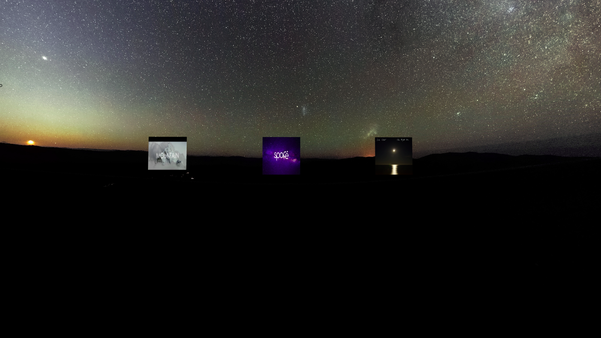

# Healthcare-WebVR

Anxiety anger and stress have become a common problem for everyone around the globe. Stress relief haas become hard as people either are too shy to go to a therapist citing various reasons or are'nt getting enough time to go to therapists .

This problem can be solved by using WebVR. A better form of VR which can be accessed by the user through websites and won't have to undergo the process of buying different VR headset like the Oculus or Daydream or anyother headset. All you need is google cardboard to put your phone in and have a different experience all together.

We have tried to recreate major scenes with the help of WEB VR using A-Frame such that the help the normal man cope with stress, anxiety and anger. These scenes make you feel better and warmer.

The advantage of having VR on the web is that, it is accessible to everyone with a phone or a laptop with internet.

# How Music heals the soul

  Music therapy has been a constant practice in the west for kids and adults, going through anxiety, stress and various other mental helath issues. As it turns out, music is beneficial for the mind, the body and soul. Here’s a look at the various issues musics heals.

The Emotional

• Music may do a better job of lowering anxiety levels than anti-anxiety drugs do, according to one study that measured the outcome of over 400 studies published in the in the journal Trends in Cognitive Sciences.

• As many of us have experienced ourselves, music can definitely lift our moods and statistically can help with depression.

The Intellectual

• It’s also been shown to improve cognitive function and increase performance and reaction time when people are put in high pressure situations.

The Physical

• There’s strong evidence out there that music actually helps us cope with pain, or reduces our experience of it. (This might very well be true for other forms of pain—not just physical!) Music therapy is often used to help sooth those about to undergo surgery, or who are recovering from it.

• Perhaps it’s because of our elevated moods that we also work out harder, and for longer when we listen to music. In one study, findings showed that listening to music after a workout can help speed up recovery.

• Other findings show that music can help improve sleep quality, help control appetite and prevent overeating, and improve blood flow to the brain and other areas of the body.

The “Spiritual”

• It’s true that music affects many different parts of your brain; but there’s one part in particular that’s directly related to how pleasurable a song is for the listener. Slow tunes alter brain wave patterns, which can induce a meditative, restorative state.

# How it was made

Three different scenes where created with the help of A-Frame so as to make the experience more immersive. These scenes were added together to form one scene such that the user can choose one scene he likes on the go. This becomes intuituve for the user.

Different background sounds were added to each scene so as to make them feel as realistic as possible.

# Here are a few images of the headset 
      
 

  This is the page you are greeted with when you enter the website.
  
  
     This is the VR Webpage represting mountains.
     
   
   
      This is a scene where you can sit and relax and listen to the waves that come and go by. The soothing sounds of the waves help you feel better.
      
  
    This scene is one where you definitely feel as if you are in space. Makes you feel lively and fresh in a never before experienced scene .

Check the instructions.txt file on how to run and what to download.
